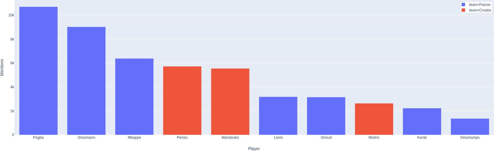

# what-twitter-says
Three individual scripts to collect, clean and analyze tweets

## Requirements
* Python 3
* Tweepy
* TextBlob

## Usage
* Clone repo
* Install required additional libraries
* Fill in your Twitter App credentials to config.py
* Run the desidered script in the terminal
```bash
python3 data_collection.py
python3 data_preparation.py
python3 sentiment_analysis.py
```

## Analysis example: 2018 FIFA World Cup Final
Sentiment analysis of Twitter comments:
&nbsp;

&nbsp;
&nbsp;
Most mentioned players on Twitter:
